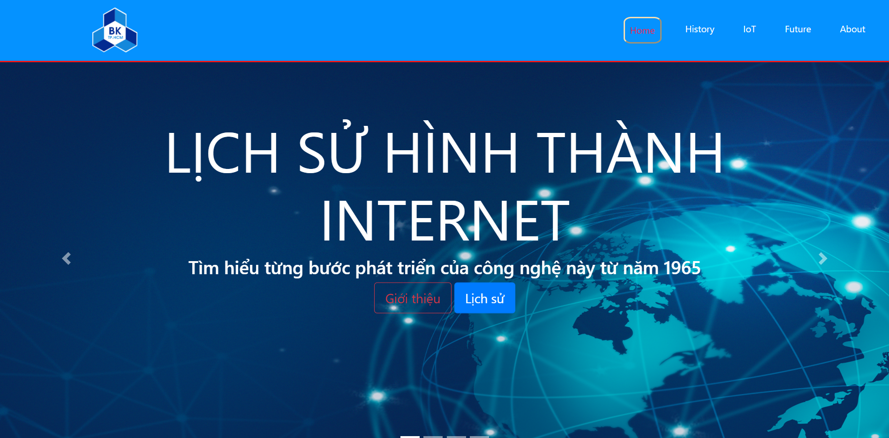
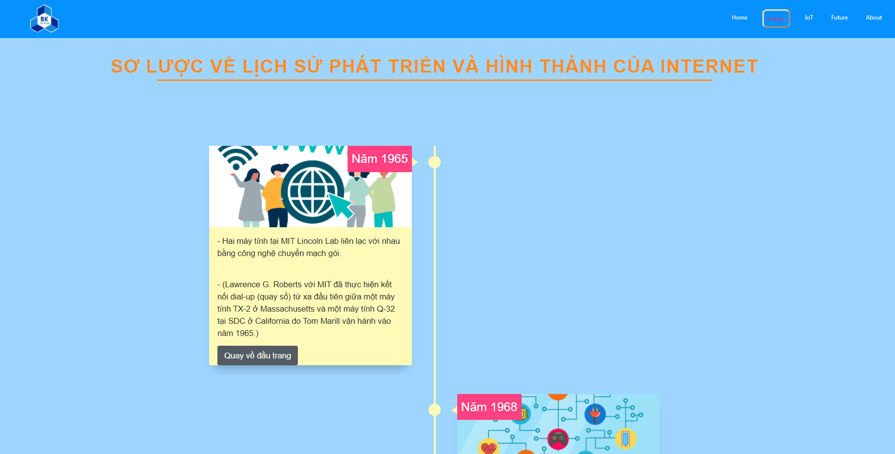
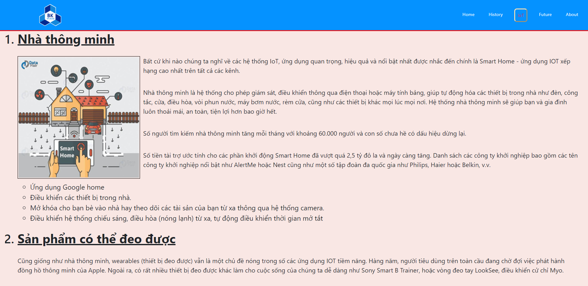
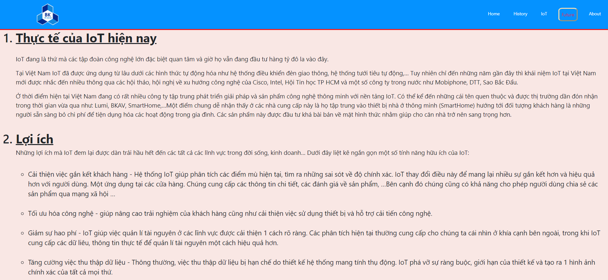
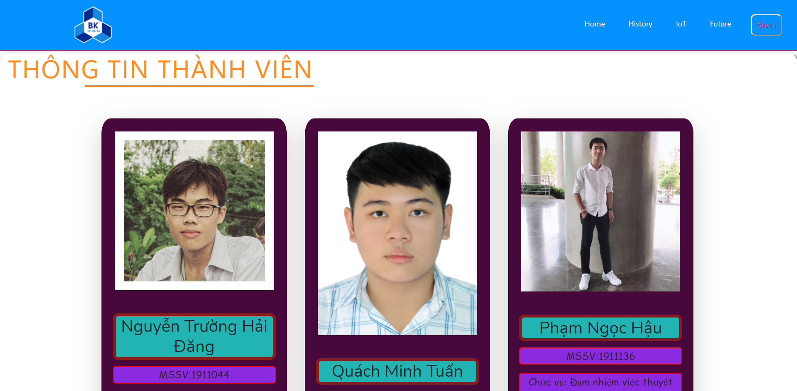

# IOT preview history 
Assignment of `Introduction to Computing class.`   
This is a simple front-end Web in order to introduce about the IOT (Internet of things) and its history. We used some popular frameworks and packages such as bootstrap, jquery,... for the convenience. All the content is written in `Vietnamese language`.

## Authors
Quach Minh Tuan - Nguyen Truong Hai Dang - Pham Ngoc Hau - Nguyen Tan Dat -  Nguyen Tho Nam
## Version
1.0.0

## Usage
Clone this source code
```sh
$ git clone https://github.com/nh0znoisung/IOT_preview.git
$ cd IOT_preview
```
Open `index.html` file on your browser

**OR**

Visit page: https://nh0znoisung.github.io/IOT_preview/


## Home page
Introduce generally about IOT.


## History of IOT
This is designed as a timeline and sorted by time with events from 1965 to 2016.


## Application of IOT
About some application of IOT such as smart house, smart city, wearable products,...


## Future of IOT
It illustrates the real-life application in these day, advantages, disadvantages and our opinion about IOT.


## About us
This page shows some basic information about each member in this team including name, student ID and responsibility. Next, scroll to the bottom of page, there is some documents that we referenced in this project and some frameworks that were used in this project.
